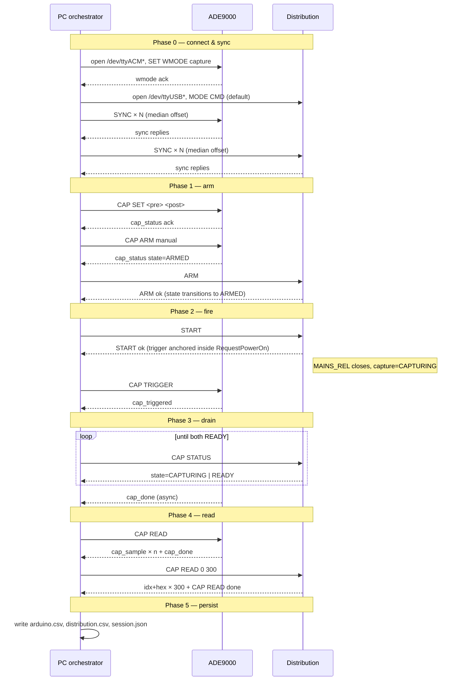

# Startup Sequence Orchestrator

**Scope:** How the PC application coordinates two independent devices
(ADE9000 PhaseMonitor and the MPS2P Distribution Board) to capture a
single power-supply startup event across the AC input side and the
internal power-distribution side, and emit one analyzable session on
disk.

This document is the authority for PC-side orchestration logic. When it
contradicts the per-device protocols
([firmware-pc.md](firmware-pc.md) and the Distribution RS-485 spec in
the `mps2p-FW-db-v3` memory), the per-device protocols win — this
document adapts.

---

## 1. Roles

```
  AC mains ─┐
            ├── ADE9000 PhaseMonitor   ── USB CDC (115200, JSON Lines) ──┐
            │     observes Uab/Ubc/Uca + Ia/Ib/Ic, fast RMS ~10 ms       │
            │                                                             ▼
            │                                                        PC orchestrator
            ▼                                                             ▲
     Rectifier ─► Distribution Board   ── USB-RS485 (57600, text) ──────┘
                    MAINS_REL + PRECHRG, 8× ADS1115 channels
                    (V1/V2/V3 per channel), ~25 ms/sample
```

| Role | Device | Function |
|---|---|---|
| **AC-side observer** | ADE9000 PhaseMonitor | Line-to-line or line-to-neutral RMS + phase currents during the startup |
| **Trigger master** | Distribution Board | MAINS_REL closure defines `t=0` for the whole session |
| **Internal observer** | Distribution Board | 8 raw ADS1115 samples per period, covers precharge + bypass |
| **Orchestrator / archiver** | PC application | SYNC, ARM/START choreography, error policy, CSV + metadata |

The PC never generates `t=0` itself. The physical closure of MAINS_REL
is the only real zero.

---

## 2. Terminology mapping

The initial TECH_SPEC used generic `MONITOR` / `CAPTURE` terms. The two
devices use different words for similar concepts, and on Distribution
two independent axes exist simultaneously. Use the right column when
reading code.

| TECH_SPEC concept | ADE9000 | Distribution |
|---|---|---|
| "live stream on" | `WMODE monitor` + `SET MODE delta\|wye` | `MODE STREAM` (HV print enabled) |
| "capture mode" (command-only) | `WMODE capture` (telemetry suspended) | `MODE CMD` (default, silent) |
| "arm capture" | `CAP ARM manual` or `CAP ARM dip <V>` | `ARM` |
| "manual trigger" | `CAP TRIGGER` command | **does not exist** — trigger is the physical MAINS_REL event |
| "capture complete" | async `cap_done` event | poll `CAP STATUS` until `state=READY` |
| "read captured data" | `CAP READ` (streams JSON `cap_sample` rows) | `CAP READ <offset> <count>` (text: `idx` + 8× hex16 raw) |
| "async event channel" | event flags in every telemetry packet (`flags[]`) | `EVT:` prefix lines, gated by `EVENTS ON` |

### Orthogonality on Distribution

The two axes are independent:

```
 MODE      ∈ { CMD, STREAM }       (HV telemetry print gate)
 capture   ∈ { IDLE, ARMED,
              CAPTURING, READY,
              ERROR }               (sample ring FSM)
```

`CAP READ` is only allowed in `MODE=CMD` AND `capture=READY`. Other
combinations return `err_busy` / `err_not_ready` without side effects.

---

## 3. Timing model

### 3.1 Per-device clocks

Each device owns its own `millis()`-equivalent free-running tick counter
(referred to below as `tick_ms`). No wall-clock time, no NTP, no
cross-device hardware sync.

### 3.2 Sample period — asymmetric, by design

| Device | `sample_period_ms` | Buffer | Window |
|---|---|---|---|
| ADE9000 | ≈ 10 (half-cycle RMS) | 500 samples, split `pre/post` via `CAP SET` (default 100/200) | ≈ 3 s around the event |
| Distribution | ≈ 25 (ADS1115 @ 860 SPS over ISO1540 I²C) | 300 samples, fixed `CAP_N_PRE=50` / `CAP_N_POST=250` | ≈ 7.5 s around the event |

Asymmetry is a hardware constraint, not a bug:

- ADE9000 is fast because RMS registers update every half cycle.
- Distribution is slow because the ADS1115 conversion pacing + I²C
  bridge cap at ~40 Hz per channel.
- 7.5 s on Distribution is the useful property: precharge is 10–15 s,
  so the window frames the entire MAINS_REL → bypass transition well
  enough for postmortem analysis. The 3 s ADE9000 window zooms in on
  the AC-side reaction.

Both numbers are MEASURED (last-delta between samples), not nominal —
RTOS scheduling is not real-time.

### 3.3 Sample index convention (both devices)

`i = 0` is the sample at which the trigger fired.
Negative `i` are pre-trigger samples, positive `i` are post-trigger.

```
absolute_tick_ms(i) = trigger_tick_ms + (i − trigger_index) * sample_period_ms
```

ADE9000 uses `trigger_index=0` (see `firmware-pc.md`). Distribution
stores samples in a ring and computes the logical index on read;
`trigger_index=0` is also the convention there.

### 3.4 Offset estimation

Per-device clock offset relative to the PC monotonic clock is estimated
via a SYNC probe, identical procedure on both devices:

```
offset = device_tick_ms − (t_send_pc + t_recv_pc) / 2
```

PC collects N=25 probes, sorts by RTT, takes median of cleanest K=8.

ADE9000: `SYNC <seq>` → `{"status":"ok","event":"sync","seq":<n>,"tick_ms":<t>}`.
Distribution: `SYNC <seq>` → `SYNC ok seq=<n> tick=<t>` (text), where
`tick` is `HAL_GetTick()`. Same N=25 / best K=8 procedure on both sides.

The cross-device offset is:

```
offset_ad = offset_arduino − offset_distribution
```

Given `offset_ad`, any ADE9000 sample can be placed on the Distribution
clock (or a common "PC monotonic" clock) at analysis time.

---

## 4. Orchestration sequence (happy path)



Steps in detail:

1. **Connect.** Open both serial ports. Send `SET WMODE capture` to
   ADE9000 — GUI must ignore telemetry until the ack arrives (per
   `firmware-pc.md` connect handshake). Distribution starts in
   `MODE CMD` silent; no handshake needed.
2. **Sync.** Run 25 `SYNC` probes on ADE9000, take median-of-8. Do the
   same with `SYNC <seq>` on Distribution. Store `offset_arduino`,
   `offset_distribution`, derive `offset_ad`.
3. **Configure pre/post on ADE9000.** Send `CAP SET <pre> <post>`
   (`pre+post ≤ 500`). Distribution pre/post is fixed in firmware.
4. **Arm.** `CAP ARM manual` on ADE9000, then `ARM` on Distribution.
   Order matters: ADE9000 should be ready first, so the AC-side
   pre-ring is filled by the time Distribution starts physically
   closing the relay.
5. **Fire.** Send `START` to Distribution. It internally triggers
   capture at the decision point inside `RequestPowerOn()` — before
   `PowerOn()` runs, per `project_capture_spec.md`.
6. **Trigger ADE9000.** As soon as `START` returns successfully, send
   `CAP TRIGGER` to ADE9000. This is the only correct moment —
   triggering earlier misses inrush, triggering later via `dip` mode
   is a valid alternative (§5.2) but produces a different `i=0`.
7. **Drain.** Poll `CAP STATUS` on Distribution until `state=READY`.
   ADE9000 emits `cap_done` asynchronously — listen for it in the same
   loop.
8. **Read.** `CAP READ` on both devices. On Distribution the command
   takes `<offset> <count>`; read the full buffer
   (`CAP READ 0 300` for the current config). Per the Distribution
   spec, `CAP READ` is allowed only when `MODE=CMD` AND
   `capture=READY` — if either check fails, abort the session cleanly.
9. **Persist.** Write session artifacts per §6.

---

## 5. Trigger policy

### 5.1 Distribution = trigger master

The physical zero of the system is MAINS_REL closure. Distribution
anchors `trigger_tick` inside `RequestPowerOn()` at the decision point,
not at the HAL_GPIO write, per `project_capture_spec.md`. There is no
`CAP TRIGGER` command on Distribution — by design.

### 5.2 ADE9000 secondary trigger

Two options, both supported:

- **`CAP ARM manual` + PC-issued `CAP TRIGGER`** after Distribution
  `START` returns. Pro: deterministic order relative to MAINS_REL.
  Con: PC serial round-trip adds a few ms of skew, absorbed by
  `offset_ad` at analysis time.
- **`CAP ARM dip <V>`** with a threshold below nominal mains. Pro:
  anchors ADE9000 to the actual AC-side event (inrush dip). Con:
  misses if the supply is stiff enough that no dip crosses the
  threshold.

Pick per session; default is manual. The choice is recorded in
`session.json` (§6).

---

## 6. Session artifacts

One session = one directory:

```
captures/<YYYY-MM-DDTHH-MM-SS>/
  arduino.csv
  distribution.csv
  session.json
```

### 6.1 `arduino.csv`

One row per ADE9000 sample. Columns match `cap_sample` JSON fields
in `firmware-pc.md` §Capture pipeline (mode-dependent):

- delta: `i, uab, ubc, uca, ia, ib, ic`
- wye: `i, va, vb, vc, ia, ib, ic`

Header row written once. `i` is integer with sign, spans `[-pre, +post)`.

### 6.2 `distribution.csv`

One row per Distribution sample. Columns fixed by `db_tool.py`'s
existing layout (see `reference_db_tool.md`):

```
idx, ch0_raw, ch0_hex, ch1_raw, ch1_hex, ..., ch7_raw, ch7_hex
```

`idx` spans `[0, 300)` today. PC-side derivation of V1/V2/V3 per
channel and Module1 = V1−V2, Module2 = V2−V3, Total = V1−V3 is done
at analysis time, not at capture time — keeps the CSV reversible.

### 6.3 `session.json`

Single source of truth for cross-device correlation:

```json
{
  "schema_version": 1,
  "session_id": "2026-04-24T18-32-07",
  "started_at_pc_ns": 172874...,

  "devices": {
    "arduino": {
      "fw": "ADE9000 Phase Monitor 1.0",
      "port": "COM5",
      "mode": "delta",
      "wmode": "capture",
      "trigger_mode": "manual",
      "trigger_tick_ms": 42000,
      "sample_period_ms": 10,
      "pre": 100,
      "post": 200,
      "trigger_index": 0,
      "offset_ms": 17234.5
    },
    "distribution": {
      "fw_hash": "4cddbcc",
      "port": "COM7",
      "mode": "CMD",
      "trigger_tick_ms": 123456,
      "sample_period_ms": 25,
      "pre": 50,
      "post": 250,
      "trigger_index": 0,
      "offset_ms": 9023.1,
      "rtt_ms_best": 3.2,
      "n_sync_samples": 25,
      "channels": 8
    }
  },

  "offset_ad_ms": 8211.4,

  "events": [
    {"source": "distribution", "tick_ms": 123450, "kind": "mode_detected", "value": "400V"},
    {"source": "arduino", "tick_ms": 42010, "kind": "dip"}
  ]
}
```

Fields are written at the end of the session, after both `CAP READ`s
complete. `events` is optional but populated when either device reports
EVT-like traffic during the session.

### 6.4 Merged view

Deliberately out of scope at capture time. Analysis tooling reads the
three files and produces a unified timeline using
`absolute_tick_ms(i)` and `offset_ad_ms`.

---

## 7. Error matrix

| Case | Detection | PC response |
|---|---|---|
| Distribution returns `vbus_error` on `START` | START reply parse | Cancel session. `Capture_NotifyVbusBlock` fires on FW side — PC sends `CAP ABORT` to ADE9000, does NOT write CSV. Log reason. |
| Distribution `EVT: vbus_block` during session (Phase 5, pending) | async line with `EVT:` prefix | Same as above — abort, log. |
| ADE9000 `dip` arm times out (no dip within N seconds) | timer in PC orchestrator | Options: (a) send `CAP TRIGGER` manually and accept a degraded session, (b) `CAP ABORT` + retry. Configurable; default (a). |
| Distribution `CAP STATUS` stays `CAPTURING` past `window × 1.5` | timeout on poll loop | `CAP ABORT`-equivalent (no command today — re-`ARM` clears to IDLE). Flag session as failed. |
| ADE9000 serial port disconnects mid-capture | serial error | `CAP ABORT` on Distribution. No partial CSV. |
| Distribution serial port disconnects mid-capture | serial error | `CAP ABORT` on ADE9000. No partial CSV. |
| One device never sends `cap_done` / never reaches READY | timeout | Abort both, do not write CSV. |
| Both READY but CSV write fails (disk full, permissions) | OS error | Keep the session in memory, surface error to UI; do not silently drop data. |

Partial sessions are never written. Either both CSVs + `session.json`
land together, or nothing does.

---

## 8. Open questions / follow-ups

These are not blockers for PC orchestration v1, but need tracking:

- **Distribution async `cap_done`.** Today PC polls `CAP STATUS`.
  An EVT-channel `EVT: cap_ready` would remove the poll. Scope:
  Phase 5 adjacent work.
- **Distribution `CAP ABORT`.** Today there is no explicit abort;
  re-`ARM` clears to IDLE. Explicit `CAP ABORT` would be cleaner
  error-path contract.
- **18V rail.** Intentionally excluded from CAP channels (unreliable,
  per TECH_SPEC §3.5). If later needed, surface as EVT on Distribution,
  not as an extra sample column.
- **Configurable Distribution pre/post.** `CAP_N_PRE` / `CAP_N_POST`
  are compile-time today. `CAP CFG` is in the phase plan (PR 5) —
  sequencer will adopt it once landed.

---

## 9. Out of scope

- Merging the two CSVs into one timeline at capture time (done at
  analysis).
- Drift correction across long runs. Single-session offset is
  sufficient for the 7.5 s capture window.
- Wall-clock time in artifacts. PC monotonic is the anchor; host
  clock appears only as `started_at_pc_ns` for directory naming and
  human readability.
- Multi-session batching / automatic retry loops. One session = one
  user action.
